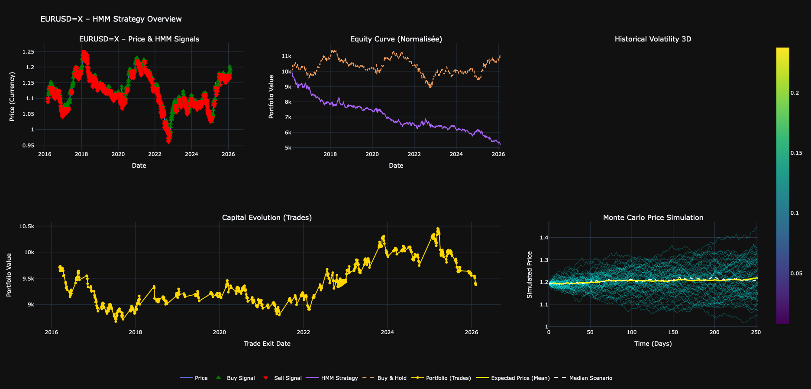
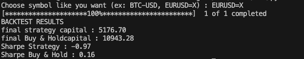

# Market Regime Detection with Hidden Markov Models

> Automatic detection of market regimes (bullish/neutral/bearish) with backtesting and Monte Carlo simulation.
[](https://www.python.org/downloads/)


---

## Project Goal

This project implements a complete market regime detection system using Hidden Markov Models **(HMM)** to automatically identify bullish, bearish, and sideways phases in financial markets.

### Usage

```python
# Run the main program
python main.py

# Choose a financial symbol (BTC-USD, AAPL, ^GSPC)
Enter financial symbol: BTC-USD
```

The program will:
1. Download historical data (Yahoo Finance)
2. Calculate ROC indicator (Rate of Change)
3. Train the HMM to detect regimes
4. Generate trading signals
5. Perform backtesting (daily + per trade)
6. Simulate 1000 Monte Carlo scenarios
7. Display interactive visualizations

---

## 📁 Project Structure

```
HMM-BACKTESTING/src/
│
├── main.py                    # Main entry point
│
├── data/
│   └── data_loader.py         # Data retrieval (yfinance)
│
├── models/
│   └── hmm_model.py           # HMM implementation (hmmlearn)
│
├── indicators/
│   └── indicators.py          # ROC and other indicators
│
├── signals/
│   └── signals.py             # Trading signal generation
│
├── backtest/
│   ├── backtest_daily.py      # Daily backtesting
│   └── backtest_trades.py     # Trade-by-trade backtesting
│
├── metrics/
│   └── metrics.py             # Sharpe Ratio, volatility, etc.
│
├── simulation/
│   └── monte_carlo.py         # Monte Carlo simulation
│
├── visualization/
│   └── plots.py               # Interactive charts (Plotly)
│
├── README.md                  # This file

```

---

## Technologies Used

| Technology | Usage |
|------------|-------|
| **Python 3.8+** | Main language |
| **pandas** | Time series manipulation |
| **NumPy** | Numerical computations |
| **hmmlearn** | HMM implementation |
| **scikit-learn** | Data normalization |
| **yfinance** | Market data retrieval |
| **Plotly** | Interactive visualizations |

## Author

**Vincent GAUTHEREAU**
-  Engineering Student at ICAM Toulouse, FRANCE (4th year)
- [LinkedIn](www.linkedin.com/in/gauthereau-vincent-14ba28238)
- [GitHub](https://github.com/vinsgte)